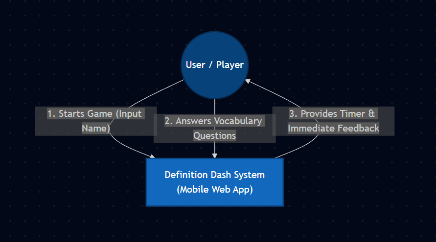
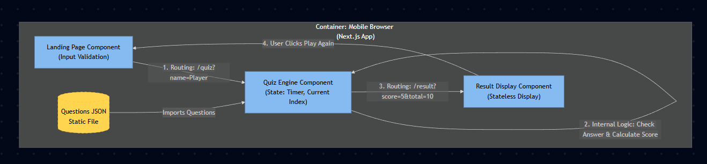

# System Architecture Diagram (C4 Model - Container Level)

## คำอธิบาย
แผนภาพแสดงสถาปัตยกรรมของ "Definition Dash" ในระยะ MVP ซึ่งทำงานในลักษณะ **Client-Side Web Application** ทั้งหมด โดยไม่มีการเชื่อมต่อ Database หรือ External API ในเฟสนี้ การทำงานหลักเกิดขึ้นบน Browser ของผู้ใช้งานผ่าน Next.js Framework

# Level 1: System Context Diagram

# Level 2 Container Diagram

# Level 3: Component Diagram
