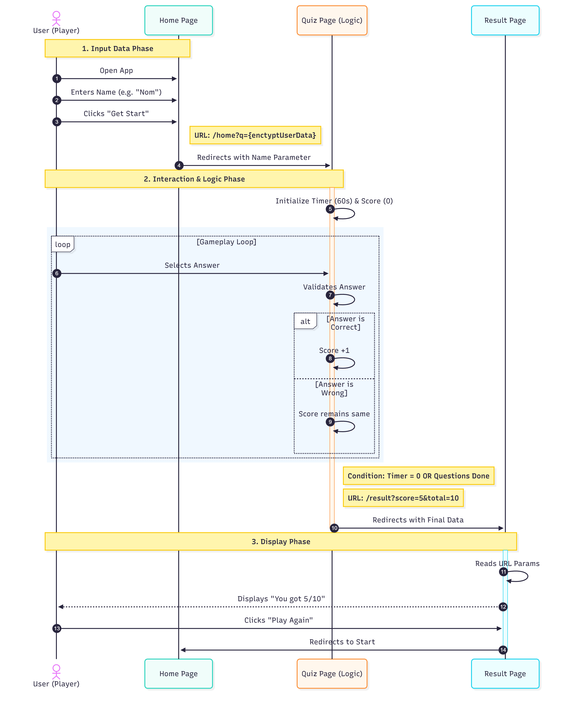
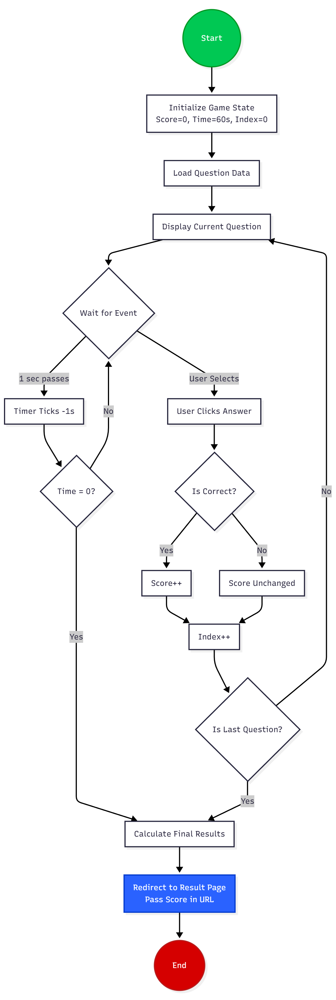

# Data Flow / Sequence Diagram

## คำอธิบาย
เนื่องจากระบบในระยะ MVP ไม่มีการใช้ฐานข้อมูล (Database) การจัดการข้อมูลจึงใช้รูปแบบ **Stateless** โดยส่งผ่านค่าตัวแปร (Data Passing) ระหว่างหน้าเว็บด้วย **URL Query Parameters** แผนภาพด้านล่างแสดงลำดับการทำงานและการไหลของข้อมูลตั้งแต่เริ่มจนจบเกม

# 1. Sequence Diagram

# 2. Activity Diagram
